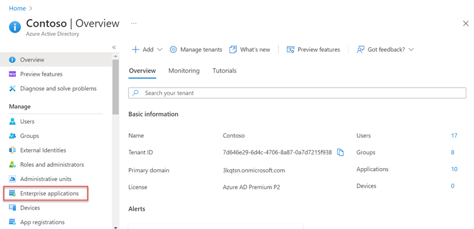
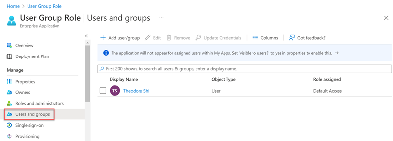
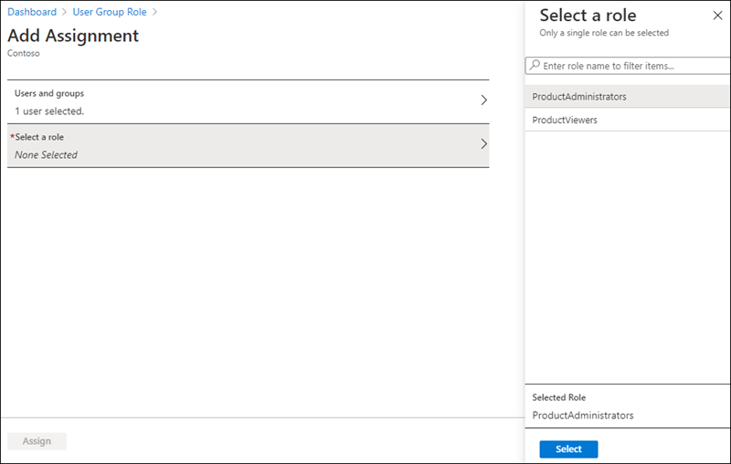
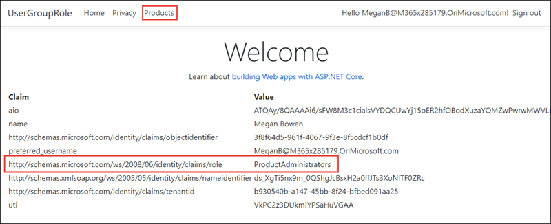

# Exercise 3:  Leverage application roles in custom apps

In this exercise, you’ll learn how to create and configure an application registration to define app roles, assign users and groups to those roles and authorize access to a controller using those assignments.

> [!IMPORTANT]
> This exercise assumes you have completed the second exercise in this module. 

## Task 1: Update the application registration

App Roles for an app registration are defined by editing the manifest. The roles have a unique identifier, a display name and a value. The value can be inspected at runtime to make authorization decisions.

Open a browser and navigate to the [Azure Active Directory admin center](https://aad.portal.azure.com). Sign in using a **Work or School Account** that has global administrator rights to the tenant.

Select **Azure Active Directory** in the left-hand navigation.

Select **App registrations** in the left-hand navigation.


On the **App registrations** page, locate the application registration that represents the Users Group Roles application from the first exercise in this module. To verify the application, compare the **Application (client) ID** and **Directory (tenant) ID** in the portal to the values copied in the first exercise.


In the application registration for your application, select **Manifest**.

In the manifest editor, find the node named `groupMembershipClaims`. Set the `groupMembershipClaims` node back to its default value, `null`:

```json
"groupMembershipClaims": null,
```

Next, within the manifest editor, find the node `optionalClaims`. Set the `optionalClaims` node back to its default value, `null`:

```json
"optionalClaims": null,
```

Finally, within the manifest editor, find the node named `appRoles`. The default value is an empty array. Replace the `appRoles` node with the following code:

```json
"appRoles": [
  {
    "allowedMemberTypes": [ "User" ],
    "description": "Administrator role for Product Catalog web application.",
    "displayName": "ProductAdministrators",
    "id": "<NEW-GUID>",
    "isEnabled": true,
    "lang": null,
    "origin": "Application",
    "value": "ProductAdministrators"
  },
  {
    "allowedMemberTypes": [ "User" ],
    "description": "Viewer role for Product Catalog web application",
    "displayName": "ProductViewers",
    "id": "<NEW-GUID>",
    "isEnabled": true,
    "lang": null,
    "origin": "Application",
    "value": "ProductViewers"
  }
],
```

When updating the value of the `appRoles` node, consider the following requirements:

- Leave allowedMemberTypes set to "User" only.
- Make sure displayName and value don't contain spaces.
- Replace the string `<NEW-GUID>` with a new GUID. Make sure ID is a unique GUID. The following PowerShell will generate a new GUID:

    ```powershell
    New-Guid
    ```

Save the manifest.

### Assign users to app roles

Open a browser and navigate to the [Azure Active Directory admin center](https://aad.portal.azure.com). Sign in using a **Work or School Account** that has global administrator rights to the tenant.

Select **Azure Active Directory** in the left-hand navigation.

Select **Enterprise applications** in the left-hand navigation.



On the **Enterprise applications** page, locate the application registration that represents the Users Group Roles application from the first exercise in this module. To verify the application, compare the **Application (client) ID** of the app registration with the **Application ID** entry in the **Enterprise Applications** list. Select the correct application.

On the enterprise application overview pane, select **Users and Groups**.



Select **Add User**. On the add **Assignment** pane, select **Users and groups**. Select one or more users or groups from the list and then select the **Select** button at the bottom of the pane.

On the **Add Assignment** pane, select **Role**. Select the **ProductAdministrator** role to apply to the selected users or groups, then select **Select** at the bottom of the pane.



Select **Assign** at the bottom of the pane. The assigned users or groups have the permissions defined by the selected role for this enterprise app.

### Update role check-in controller/view

Open the **ProductsController.cs** file in the Controllers folder.

Update the `[Authorize]` attribute to use the role names (specify multiple values allows access to members in either role):

```csharp
[Authorize(Roles =("ProductViewers,ProductAdministrators"))]
```

Open the **_Layout.cshtml** file in the **Views\Shared** folder. Locate the call to **User.IsInRole** and change the statement to the following code:

```cshtml
@if (User.IsInRole("ProductViewers") || User.IsInRole("ProductAdministrators"))
```

### Add action and view to allow creating new products

Create a new file in the **Models** folder name **ProductViewModel.cs**. Add the following to the file:

```csharp
using System.Collections.Generic;

namespace UserGroupRole.Models
{
  public class ProductViewModel
  {
    public string ProductName { get; set; }
    public int CategoryId { get; set; }
    public List<Category> Categories { get; set; }
  }
}
```

Open the **ProductsController.cs** file in the **Controllers** folder. Add the following to the top of the file:

```csharp
using System.Linq;
using UserGroupRole.Models;
```

Add the following methods to the **ProductsController.cs** file:

```csharp
[Authorize(Roles = ("ProductAdministrators"))]
public ActionResult Create()
{
  var viewModel = new ProductViewModel()
  {
    Categories = data.Categories
  };
  return View(viewModel);
}

[Authorize(Roles = ("ProductAdministrators"))]
[HttpPost]
[ValidateAntiForgeryToken]
public ActionResult Create([Bind("ProductName", "CategoryId")] ProductViewModel model)
{
  if (ModelState.IsValid)
  {
    data.Products.Add(new Product()
    {
      ID = data.Products.Max(p => p.ID) + 1,
      Name = model.ProductName,
      Category = data.Categories.FirstOrDefault(c => c.ID == model.CategoryId)
    });
    return RedirectToAction("Index");
  }
  return View(model);
}
```

Open the **Index.cshtml** file in the **Views\Products** folder. Above the `<table>` element, add the following code:

```cshtml
@if (User.IsInRole("ProductAdministrators"))
{
<p>
  <a asp-action="Create">Create New</a>
</p>
}
```

Create a new file in the **Views\Products** folder named **Create.cshtml**. Add the following to the file:

```cshtml
@model UserGroupRole.Models.ProductViewModel

@{
  ViewData["Title"] = "New Product";
}

<h1>New Product</h1>
<hr />
<div class="row">
  <div class="col-md-4">
    <form asp-action="Create">
      <div asp-validation-summary="ModelOnly" class="text-danger"></div>
      <div class="form-group">
        <label asp-for="ProductName" class="control-label"></label>
        <input asp-for="ProductName" class="form-control" />
        <span asp-validation-for="ProductName" class="text-danger"></span>
      </div>
      <div class="form-group">
        <label asp-for="CategoryId" class="control-label"></label>
        <select asp-for="CategoryId"
                asp-items=@(new SelectList(Model.Categories,"ID","Name")) class="form-control"></select>
        <span asp-validation-for="CategoryId" class="text-danger"></span>
      </div>
      <div class="form-group">
        <input type="submit" value="Save" class="btn btn-primary" />
      </div>
    </form>
  </div>
</div>

<div>
  <a asp-action="Index">Back to List</a>
</div>

@section Scripts {
  @{await Html.RenderPartialAsync("_ValidationScriptsPartial");}
}
```

#### Build and test the web app

Execute the following commands in a command prompt to compile and run the application:

```console
dotnet dev-certs https --trust
dotnet build
dotnet run
```

Open a browser and navigate to the url **https://localhost:5001**. The web application will redirect you to the Azure AD sign-in page.

Sign in using a Work and School account from your Azure AD directory. The first login will prompt for consent to the scopes required by the web API. After consent, Azure AD will redirect you back to the web application.

> Note: You must login after assigning app roles to the user. Any logins that occurred before the update will result in a token that does not reflect the assignments. Close the browser or select **Sign out** to sign out of the session.

On the home page, the assigned roles are included in the list of claims. If the user is a member of the correct group, the navigation will include a link to the Products controller.



## Summary

In this exercise, you learned how to create and configure an application registration to define app roles, assign users and groups to those roles and authorize access to a controller using those assignments.
